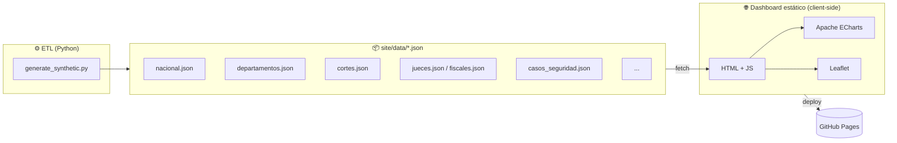
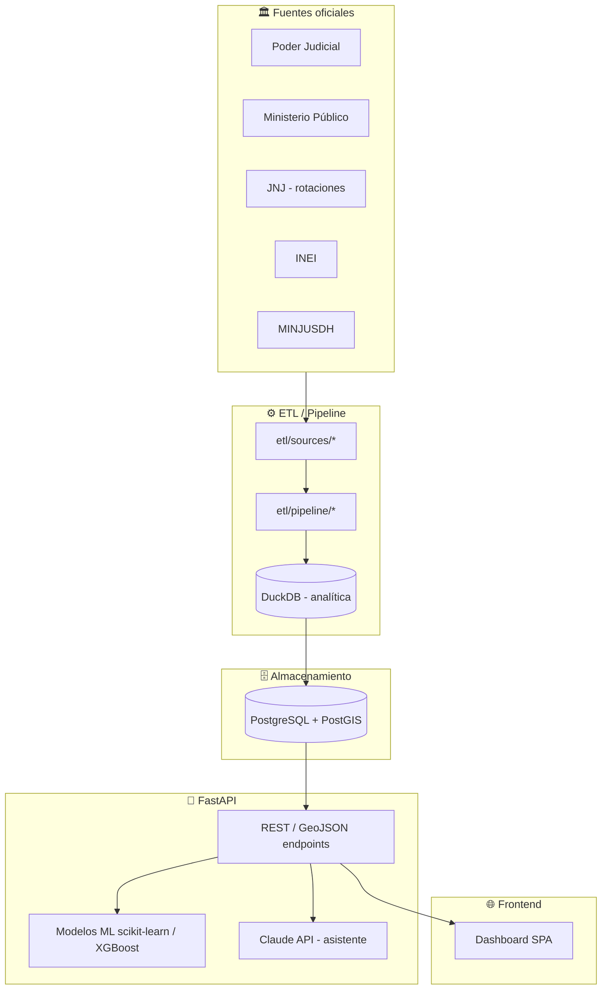

# 🏗️ Arquitectura — Observatorio Nacional del Sistema de Justicia del Perú

Este documento describe la arquitectura del proyecto, el flujo de datos en la **Fase 1**
(actual, estática) y la **visión full-stack futura**, las decisiones técnicas detrás de cada
elección, y el esquema de campos de cada dataset.

---

## 1. Vista general (Fase 1 — actual)

La Fase 1 es deliberadamente **simple y sin servidor**: un generador de datos en Python produce
archivos JSON que un dashboard estático consume directamente en el navegador.



### Diagrama ASCII equivalente

```text
  ┌──────────────────┐      ┌────────────────────┐      ┌─────────────────────┐
  │  Python ETL      │ ───► │  JSON estático     │ ───► │  Navegador (cliente) │
  │  generate_       │      │  site/data/*.json  │ fetch│  ECharts + Leaflet   │
  │  synthetic.py    │      │  (manifest.json)   │      │  (sin backend)       │
  └──────────────────┘      └────────────────────┘      └──────────┬──────────┘
                                                                    │
                                                                    ▼
                                                          ┌──────────────────┐
                                                          │   GitHub Pages    │
                                                          └──────────────────┘
```

---

## 2. Flujo de datos: Fase 1 vs. visión futura

### Fase 1 (estática)

```text
generate_synthetic.py  ──►  site/data/*.json  ──►  fetch()  ──►  ECharts/Leaflet  ──►  GitHub Pages
        (build time)            (artefactos)         (runtime, en el navegador)
```

- **Todo el cómputo** ocurre en *build time* (al correr el script) o en *client-side* (en el navegador).
- No hay base de datos, no hay API, no hay estado de servidor.

### Visión full-stack (Fase 2+)



---

## 3. Decisiones técnicas

### ¿Por qué estático + JSON para GitHub Pages (Fase 1)?

| Razón | Detalle |
|-------|---------|
| **Costo cero** | GitHub Pages es gratuito y no requiere servidor ni base de datos. |
| **Velocidad de entrega** | Permite tener un MVP visible y compartible en días, no en semanas. |
| **Cero mantenimiento de infra** | No hay servidor que parchar, escalar ni monitorear. |
| **Rendimiento** | Los JSON pre-agregados se sirven desde CDN; el navegador solo renderiza. |
| **Portabilidad** | Los mismos JSON alimentarán mañana una API; el contrato de datos ya existe. |
| **Reproducibilidad** | El generador usa una *seed* fija → los datos son deterministas. |

> El precio de esta simplicidad es que los datos son **pre-agregados y de solo lectura**:
> no hay filtros server-side ni consultas ad-hoc. Para la Fase 1 (exploración), es suficiente.

### ¿Por qué DuckDB y PostGIS después?

| Tecnología | Cuándo entra | Por qué |
|------------|--------------|---------|
| **DuckDB** | Fase 2–3 | Analítica OLAP local sobre archivos (Parquet/CSV) sin levantar un servidor; ideal para el *pipeline* de transformación y para benchmarks rápidos sin tocar producción. |
| **PostgreSQL** | Fase 2 | Almacén transaccional confiable para el modelo relacional (ver [`DATA_MODEL.md`](DATA_MODEL.md)): expedientes, magistrados, rotaciones, casos. |
| **PostGIS** | Fase 2 | Consultas geoespaciales reales (distritos judiciales, mapas coropléticos, proximidad), que JSON estático no permite. |
| **FastAPI** | Fase 2–3 | API tipada y rápida para servir datos filtrables y exponer modelos ML. |
| **scikit-learn / XGBoost** | Fase 4 | Predicción de demora, probabilidad de apelación/archivamiento, proyección de carga. |
| **Claude API** | Fase 5 | Asistente conversacional sobre los datos + enriquecimiento (resúmenes, normalización de texto). |

---

## 4. Esquema de los datasets (`site/data/`)

> Todos los archivos son **JSON**. Salvo `manifest.json` y `nacional.json` (objetos), el resto
> son **arrays de objetos**. Los nombres de campo siguen `snake_case` en español.

### `manifest.json` — metadatos de la generación

| Campo | Tipo | Descripción |
|-------|------|-------------|
| `generado` | string | Origen de los datos (`"sintetico"`). |
| `anio_actual` | int | Año de referencia del snapshot (2026). |
| `anio_inicio` | int | Año inicial de la serie histórica (2010). |
| `seed` | int | Semilla del generador (27806) para reproducibilidad. |
| `n_cortes` | int | Número de Cortes Superiores generadas (35). |
| `n_departamentos` | int | Número de departamentos (25). |
| `n_jueces` | int | Número de jueces sintéticos (320). |
| `n_fiscales` | int | Número de fiscales sintéticos (280). |
| `n_casos_seguridad` | int | Número de casos de seguridad (60). |
| `datasets` | string[] | Lista de datasets disponibles. |

### `nacional.json` — KPIs del sistema (objeto único)

| Campo | Tipo | Descripción |
|-------|------|-------------|
| `anio` | int | Año del snapshot. |
| `expedientes_ingresados` | int | Expedientes ingresados en el año. |
| `expedientes_resueltos` | int | Expedientes resueltos en el año. |
| `expedientes_pendientes` | int | Expedientes pendientes (stock al cierre). |
| `expedientes_activos` | int | Expedientes activos (pendientes + en trámite). |
| `clearance_rate` | float | Tasa de resolución (resueltos / ingresados). |
| `tiempo_promedio_dias` | int | Demora promedio de resolución (días). |
| `jueces` | int | Total de jueces a nivel nacional. |
| `carga_por_juez` | float | Ingresados / nº de jueces. |
| `congestion` | float | Índice de congestión procesal. |
| `indice_mora` | float | Índice de mora (proporción sin resolver). |
| `cortes_superiores` | int | Número de Cortes Superiores. |
| `nota` | string | Aviso de datos sintéticos. |

### `series.json` — serie histórica anual (array)

| Campo | Tipo | Descripción |
|-------|------|-------------|
| `anio` | int | Año (2010 … 2026). |
| `ingresados` | int | Expedientes ingresados ese año. |
| `resueltos` | int | Expedientes resueltos ese año. |
| `pendientes` | int | Stock de pendientes al cierre. |
| `demora_dias` | int | Demora promedio (días). |
| `clearance_rate` | float | Tasa de resolución del año. |

### `departamentos.json` — corte territorial (array, 25)

| Campo | Tipo | Descripción |
|-------|------|-------------|
| `departamento` | string | Nombre del departamento. |
| `lat`, `lng` | float | Coordenadas (centroide) para el mapa. |
| `poblacion_miles` | int | Población en miles de habitantes. |
| `pobreza` | float | Tasa de pobreza (0–1). |
| `riesgo_seguridad` | float | Índice de riesgo de seguridad (0–1). |
| `ingresados` | int | Expedientes ingresados. |
| `resueltos` | int | Expedientes resueltos. |
| `pendientes` | int | Expedientes pendientes. |
| `jueces` | int | Nº de jueces en el departamento. |
| `demora_dias` | int | Demora promedio (días). |
| `congestion` | float | Índice de congestión. |
| `procesos_por_1000hab` | float | Litigiosidad relativa. |
| `carga_por_juez` | float | Ingresados / jueces. |

### `cortes.json` — Cortes Superiores (array, 35)

| Campo | Tipo | Descripción |
|-------|------|-------------|
| `corte` | string | Nombre de la Corte Superior de Justicia. |
| `departamento` | string | Departamento al que pertenece. |
| `ingresados` | int | Expedientes ingresados. |
| `resueltos` | int | Expedientes resueltos. |
| `pendientes` | int | Expedientes pendientes. |
| `jueces` | int | Nº de jueces de la Corte. |
| `carga_por_juez` | float | Ingresados / jueces. |
| `clearance_rate` | float | Tasa de resolución. |
| `congestion` | float | Índice de congestión. |
| `demora_dias` | int | Demora promedio (días). |
| `riesgo_seguridad` | float | Índice de riesgo de seguridad del territorio (0–1). |
| `ranking_congestion` | int | Posición en el ranking de congestión (1 = más congestionada). |

### `tipos_proceso.json` — materias procesales (array)

| Campo | Tipo | Descripción |
|-------|------|-------------|
| `tipo` | string | Tipo de proceso (Penal, Civil, Familia, Alimentos, etc.). |
| `materia` | string | Materia agrupadora (Penal, Civil, Familia, …). |
| `casos` | int | Nº de casos de ese tipo. |
| `demora_mediana_dias` | int | Demora mediana (días). |
| `demora_p90_dias` | int | Demora en el percentil 90 (días). |
| `tasa_apelacion` | float | Proporción de casos apelados (0–1). |

### `embudo.json` — flujo del expediente (array)

| Campo | Tipo | Descripción |
|-------|------|-------------|
| `etapa` | string | Etapa procesal (Ingresados, Admitidos, En trámite, Sentenciados, Apelados, Ejecutados, Archivados). |
| `expedientes` | int | Volumen de expedientes en esa etapa. |

### `backlog.json` — juzgados con mayor acumulación (array, 100)

| Campo | Tipo | Descripción |
|-------|------|-------------|
| `id` | int | Identificador del juzgado en el ranking. |
| `juzgado` | string | Nombre del juzgado (p. ej. "3ro Juzgado Civil"). |
| `corte` | string | Corte Superior a la que pertenece. |
| `departamento` | string | Departamento. |
| `especialidad` | string | Especialidad / materia. |
| `pendientes` | int | Expedientes pendientes acumulados. |
| `demora_dias` | int | Demora promedio (días). |
| `carga` | int | Carga total (pendientes + ingresados). |

### `jueces.json` y `fiscales.json` — magistrados (arrays; 320 y 280)

Misma estructura; `rol` los distingue (`"Juez"` / `"Fiscal"`).

| Campo | Tipo | Descripción |
|-------|------|-------------|
| `id` | string | Identificador (`J0001` / `F0001`). |
| `rol` | string | `"Juez"` o `"Fiscal"`. |
| `nombre` | string | Nombre (ficticio). |
| `especialidad` | string | Especialidad actual. |
| `condicion` | string | Condición (Titular, Provisional, Supernumerario). |
| `corte_actual` | string | Corte donde está asignado hoy. |
| `anios_servicio` | int | Años de servicio. |
| `n_rotaciones` | int | Nº de rotaciones históricas. |
| `casos_seguridad` | int | Nº de casos de seguridad a su cargo. |
| `carga_actual` | int | Carga procesal actual. |
| `tasa_resolucion` | float | Tasa de resolución individual. |
| `rotaciones` | object[] | **Historial de asignaciones** (ver abajo). |

**Subobjeto `rotaciones[]`** (clave para el foco del proyecto):

| Campo | Tipo | Descripción |
|-------|------|-------------|
| `corte` | string | Corte de la asignación. |
| `especialidad` | string | Especialidad ejercida en esa asignación. |
| `condicion` | string | Condición en esa asignación. |
| `desde` | int | Año de inicio. |
| `hasta` | int | Año de fin. |
| `motivo` | string | Motivo (Encargatura, Reasignación, etc.). |

### `casos_seguridad.json` — casos álgidos (array, 60)

| Campo | Tipo | Descripción |
|-------|------|-------------|
| `id` | string | Identificador (`SEG-046`). |
| `tema` | string | Tema (Crimen organizado, Extorsión, Narcotráfico, Corrupción, Trata de personas, …). |
| `caso` | string | Carátula descriptiva del caso. |
| `corte` | string | Corte que conoce el caso. |
| `departamento` | string | Departamento. |
| `juez_id` | string | FK al juez (`jueces.json`). |
| `juez` | string | Nombre del juez. |
| `fiscal_id` | string | FK al fiscal (`fiscales.json`). |
| `fiscal` | string | Nombre del fiscal. |
| `anio_ingreso` | int | Año de ingreso del caso. |
| `dias_transcurridos` | int | Días transcurridos desde el ingreso. |
| `estado` | string | Estado procesal (Etapa intermedia, Juicio oral, …). |
| `imputados` | int | Nº de imputados. |
| `nivel_alerta` | string | Nivel de alerta (Crítico, Alto, Medio). |

### `indicadores.json` — glosario (array)

| Campo | Tipo | Descripción |
|-------|------|-------------|
| `indicador` | string | Nombre del indicador. |
| `formula` | string | Fórmula de cálculo. |
| `interpretacion` | string | Cómo leer el valor. |

> Glosario ampliado y metodología en [`INDICATORS.md`](INDICATORS.md).

---

## 5. Principio de diseño: el contrato de datos perdura

La pieza que sobrevive a todas las fases es **el esquema de los datasets**. Hoy esos campos
salen de un generador sintético; mañana saldrán de PostgreSQL vía FastAPI. El frontend no debería
notar el cambio: consume el mismo contrato JSON. Por eso la Fase 1 invierte en definir bien los
campos antes que en la infraestructura.
