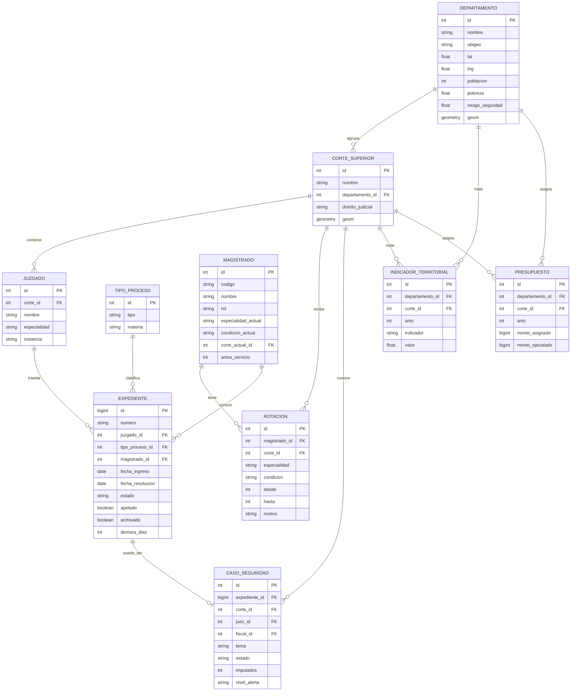

# 🗄️ Modelo de Datos — Observatorio Nacional del Sistema de Justicia del Perú

Este documento define el **modelo relacional objetivo** del proyecto: el esquema PostgreSQL
(+ PostGIS) que reemplazará a los JSON sintéticos a partir de la **Fase 2**. Es el destino del
ETL oficial y la fuente de la API (FastAPI).

> En la Fase 1 los datos viven como JSON estáticos (ver [`ARCHITECTURE.md`](ARCHITECTURE.md)).
> Aquí describimos cómo se modelan esos mismos conceptos de forma normalizada y consultable.

---

## 1. Diagrama entidad-relación



---

## 2. Tablas

### `departamento`

| Columna | Tipo | Restricción | Descripción |
|---------|------|-------------|-------------|
| `id` | `serial` | **PK** | Identificador. |
| `nombre` | `varchar(80)` | `not null`, `unique` | Nombre del departamento. |
| `ubigeo` | `char(6)` | `unique` | Código UBIGEO (INEI). |
| `lat`, `lng` | `numeric(8,5)` | | Centroide. |
| `poblacion` | `integer` | | Población (habitantes). |
| `pobreza` | `numeric(4,3)` | | Tasa de pobreza (0–1). |
| `riesgo_seguridad` | `numeric(4,3)` | | Índice de riesgo de seguridad (0–1). |
| `geom` | `geometry(MultiPolygon,4326)` | (PostGIS) | Geometría del departamento. |

### `corte_superior`

| Columna | Tipo | Restricción | Descripción |
|---------|------|-------------|-------------|
| `id` | `serial` | **PK** | Identificador. |
| `nombre` | `varchar(120)` | `not null` | Nombre de la Corte Superior. |
| `departamento_id` | `integer` | **FK → departamento.id** | Departamento. |
| `distrito_judicial` | `varchar(120)` | | Distrito judicial. |
| `geom` | `geometry(MultiPolygon,4326)` | (PostGIS) | Geometría del distrito judicial. |

### `juzgado`

| Columna | Tipo | Restricción | Descripción |
|---------|------|-------------|-------------|
| `id` | `serial` | **PK** | Identificador. |
| `corte_id` | `integer` | **FK → corte_superior.id** | Corte a la que pertenece. |
| `nombre` | `varchar(160)` | `not null` | Nombre del juzgado. |
| `especialidad` | `varchar(60)` | | Especialidad / materia. |
| `instancia` | `varchar(40)` | | Instancia (paz letrado, especializado, sala). |

### `magistrado`

> Modela tanto **jueces** como **fiscales** (campo `rol`). Es la entidad central del proyecto.

| Columna | Tipo | Restricción | Descripción |
|---------|------|-------------|-------------|
| `id` | `serial` | **PK** | Identificador. |
| `codigo` | `varchar(12)` | `unique` | Código (p. ej. `J0001`, `F0001`). |
| `nombre` | `varchar(160)` | `not null` | Nombre del magistrado. |
| `rol` | `varchar(10)` | `check (rol in ('Juez','Fiscal'))` | Rol. |
| `especialidad_actual` | `varchar(60)` | | Especialidad vigente. |
| `condicion_actual` | `varchar(30)` | | Titular / Provisional / Supernumerario. |
| `corte_actual_id` | `integer` | **FK → corte_superior.id** | Corte donde está asignado hoy. |
| `anios_servicio` | `integer` | | Años de servicio. |

### `rotacion` — historial de asignaciones (clave del proyecto)

> Una fila por cada **asignación histórica** de un magistrado. Permite reconstruir la trayectoria
> de jueces y fiscales: dónde estuvieron, en qué especialidad, con qué condición y por qué se movieron.
> Es la base de los análisis de **rotación / movilidad** de magistrados.

| Columna | Tipo | Restricción | Descripción |
|---------|------|-------------|-------------|
| `id` | `serial` | **PK** | Identificador. |
| `magistrado_id` | `integer` | **FK → magistrado.id** | Magistrado rotado. |
| `corte_id` | `integer` | **FK → corte_superior.id** | Corte de la asignación. |
| `especialidad` | `varchar(60)` | | Especialidad ejercida en esa asignación. |
| `condicion` | `varchar(30)` | | Condición en esa asignación. |
| `desde` | `smallint` | `not null` | Año de inicio. |
| `hasta` | `smallint` | | Año de fin (`null` = asignación vigente). |
| `motivo` | `varchar(60)` | | Motivo (Encargatura, Reasignación, Nombramiento, …). |

**Cómo se modela una rotación:** cada movimiento de un magistrado entre cortes/especialidades
genera un registro `rotacion(magistrado_id, corte_id, especialidad, condicion, desde, hasta, motivo)`.
La asignación vigente es la de `hasta IS NULL`, y debe ser consistente con
`magistrado.corte_actual_id` / `especialidad_actual` / `condicion_actual`. La fuente oficial de
estas rotaciones es la **Junta Nacional de Justicia (JNJ)**.

### `tipo_proceso`

| Columna | Tipo | Restricción | Descripción |
|---------|------|-------------|-------------|
| `id` | `serial` | **PK** | Identificador. |
| `tipo` | `varchar(80)` | `not null` | Tipo de proceso (Penal, Civil, Alimentos, …). |
| `materia` | `varchar(40)` | | Materia agrupadora. |

### `expediente`

| Columna | Tipo | Restricción | Descripción |
|---------|------|-------------|-------------|
| `id` | `bigserial` | **PK** | Identificador. |
| `numero` | `varchar(40)` | `unique` | Número de expediente. |
| `juzgado_id` | `integer` | **FK → juzgado.id** | Juzgado que tramita. |
| `tipo_proceso_id` | `integer` | **FK → tipo_proceso.id** | Tipo de proceso. |
| `magistrado_id` | `integer` | **FK → magistrado.id** | Magistrado a cargo. |
| `fecha_ingreso` | `date` | `not null` | Fecha de ingreso. |
| `fecha_resolucion` | `date` | | Fecha de resolución (`null` = pendiente). |
| `estado` | `varchar(40)` | | Estado procesal. |
| `apelado` | `boolean` | `default false` | Si fue apelado. |
| `archivado` | `boolean` | `default false` | Si fue archivado. |
| `demora_dias` | `integer` | | Días hasta resolución (derivado). |

### `caso_seguridad`

| Columna | Tipo | Restricción | Descripción |
|---------|------|-------------|-------------|
| `id` | `serial` | **PK** | Identificador (p. ej. `SEG-046`). |
| `expediente_id` | `bigint` | **FK → expediente.id** | Expediente asociado (si existe). |
| `corte_id` | `integer` | **FK → corte_superior.id** | Corte que conoce el caso. |
| `juez_id` | `integer` | **FK → magistrado.id** | Juez del caso. |
| `fiscal_id` | `integer` | **FK → magistrado.id** | Fiscal del caso. |
| `tema` | `varchar(60)` | | Crimen organizado, Extorsión, Narcotráfico, Corrupción, Trata, … |
| `estado` | `varchar(40)` | | Estado procesal. |
| `anio_ingreso` | `smallint` | | Año de ingreso. |
| `dias_transcurridos` | `integer` | | Días transcurridos. |
| `imputados` | `integer` | | Nº de imputados. |
| `nivel_alerta` | `varchar(20)` | | Crítico / Alto / Medio. |

### `indicador` (catálogo) e `indicador_territorial` (valores)

`indicador` es el **catálogo** de métricas; `indicador_territorial` guarda los **valores**
calculados por territorio y año.

**`indicador`**

| Columna | Tipo | Restricción | Descripción |
|---------|------|-------------|-------------|
| `id` | `serial` | **PK** | Identificador. |
| `nombre` | `varchar(80)` | `not null`, `unique` | Nombre del indicador. |
| `formula` | `text` | | Fórmula de cálculo. |
| `interpretacion` | `text` | | Cómo leer el valor. |
| `unidad` | `varchar(20)` | | Unidad (ratio, días, %, por_1000). |

**`indicador_territorial`**

| Columna | Tipo | Restricción | Descripción |
|---------|------|-------------|-------------|
| `id` | `serial` | **PK** | Identificador. |
| `indicador_id` | `integer` | **FK → indicador.id** | Indicador medido. |
| `departamento_id` | `integer` | **FK → departamento.id** (nullable) | Territorio. |
| `corte_id` | `integer` | **FK → corte_superior.id** (nullable) | Corte (alternativa al depto.). |
| `anio` | `smallint` | `not null` | Año de la medición. |
| `valor` | `numeric(12,4)` | | Valor del indicador. |

### `presupuesto`

| Columna | Tipo | Restricción | Descripción |
|---------|------|-------------|-------------|
| `id` | `serial` | **PK** | Identificador. |
| `departamento_id` | `integer` | **FK → departamento.id** (nullable) | Territorio. |
| `corte_id` | `integer` | **FK → corte_superior.id** (nullable) | Corte. |
| `anio` | `smallint` | `not null` | Año fiscal. |
| `monto_asignado` | `bigint` | | Presupuesto asignado (S/). |
| `monto_ejecutado` | `bigint` | | Presupuesto ejecutado (S/). |

> `presupuesto` y `departamento.pobreza` / `riesgo_seguridad` son los insumos de la **Fase 5**
> para construir el índice de prioridad de inversión judicial y recomendar dónde crear juzgados.

---

## 3. Relaciones clave (resumen)

```text
departamento 1───∞ corte_superior 1───∞ juzgado 1───∞ expediente
                                                          │
tipo_proceso 1──────────────────────────────────────────┘
magistrado  1───∞ rotacion ∞───1 corte_superior
magistrado  1───∞ expediente
magistrado  1───∞ caso_seguridad (como juez y como fiscal)
expediente  1───o caso_seguridad
departamento/corte 1───∞ indicador_territorial ∞───1 indicador
departamento/corte 1───∞ presupuesto
```

---

## 4. Notas de implementación

- **PostGIS:** `departamento.geom` y `corte_superior.geom` habilitan mapas coropléticos reales y
  consultas espaciales (proximidad, cobertura). Índices `GIST` sobre las columnas `geometry`.
- **Particionado:** `expediente` crecerá a millones de filas/año; conviene particionar por
  `fecha_ingreso` (rango anual).
- **Índices sugeridos:** FKs (`juzgado_id`, `magistrado_id`, `tipo_proceso_id`), `expediente(estado)`,
  `rotacion(magistrado_id, desde)`, `caso_seguridad(tema, nivel_alerta)`.
- **Magistrado polimórfico ligero:** un solo `magistrado` con `rol` evita duplicar la lógica de
  rotaciones; las vistas `juez` / `fiscal` se obtienen filtrando por `rol`.
- **Derivados vs. almacenados:** indicadores como congestión o clearance pueden materializarse en
  `indicador_territorial` (para velocidad) o calcularse en vista; ver fórmulas en [`INDICATORS.md`](INDICATORS.md).
